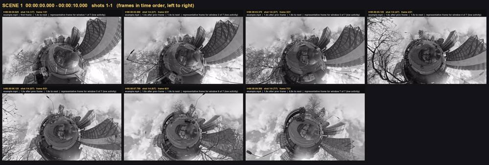
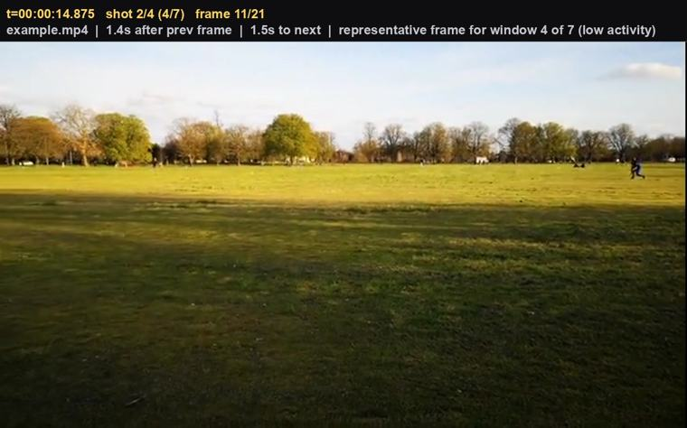

# Worked example

What the converter produces, on a video anyone can rebuild.

The source is a 40-second montage of **four CC0 clips from
[pexels.com](https://www.pexels.com/search/videos/creative%20commons%20zero/)**,
joined end to end with hard cuts at 10s, 20s and 30s. A montage rather than a
single clip, because most of what this format has to say is about *structure* —
where the cuts are, which shots resemble which, how the camera behaves in each.

| segment | clip | pexels id |
|---|---|---|
| 0–10s | 360 black and white urban panorama | 35803522 |
| 10–20s | pan shot of a grass field | 4085319 |
| 20–30s | metro cdmx | 19595834 |
| 30–40s | patterns and lines on white background | 10922866 |

## Reproduce it

```bash
bash tests/make_example.sh                            # fetch clips, build the montage
python3 vtl_convert.py /tmp/vtl-example/example.mp4
cat /tmp/vtl-example/example.vtl/TIMELINE.md
```

The clips are not committed. CC0 or not, the montage is about 5 MB and the whole
repo is a fifth of that, so the script fetches them on demand instead.

## What it found

4 shots, 21 frames, 3 text events.
Analysed at 8.0 Hz on a 96×54 proxy
(320 samples).

| shot | span (s) | enters by | motion | measurement |
|---|---|---|---|---|
| 1 | `0.0`–`10.0` | start | `static` | pan -0.005 framewidths/s, tilt +0.003 frameheights/s, zoom +0.003 scale/s |
| 2 | `10.0`–`20.0` | cut | `pan_left` | pan -0.093 framewidths/s, tilt +0.001 frameheights/s, zoom -0.011 scale/s |
| 3 | `20.0`–`30.0` | cut | `static` | no measurable motion |
| 4 | `30.0`–`40.0` | cut | `static_camera_moving_subject` | pan +0.001 framewidths/s, tilt +0.002 frameheights/s, zoom -0.006 scale/s |

**Cut detection landed on 10.0, 20.0 and 30.0** — the exact joins, to the
analysis interval. Nothing was invented between them and nothing was missed.

**Shot 2 is measured, not guessed.** The clip is titled "pan shot of a grass
field" and the converter reports `pan_left` at 0.093 framewidths per second. An
independent check agrees: `tests/crosscheck_motion.py` measures the same span by
FFT phase correlation, an algorithm sharing no code with the block matcher.

**Shot 3 reports what it could not measure**: *"only 2 of 79 samples had
measurable motion once brightness changes are discounted"*. That is the format
declining to describe a camera move it cannot see, rather than reporting a small
number as though it meant something.

**Shot 4 separates the camera from its contents** — `static_camera_moving_subject`.
Things move; the frame does not.



*One row per scene where scene grouping applies; here it does not (four shots,
four colour signatures, nothing to partition), so the sheet is simply the frames
in time order.*

## Frames carry their own context



Every extracted frame has its timestamp, shot number, position within the shot
and the gap since the previous frame burned into a header bar, plus the reason it
was selected. A frame separated from the timeline still knows where it came from.

## On-screen text, and why confidence is printed

These four clips contain no text. OCR reports 3 events anyway:

| at (s) | times seen | confidence | text |
|---|---|---|---|
| `1.0` | 1 | 84 | `GA` |
| `9.0` | 2 | 59 | `ay` |
| `19.0` | 2 | 64 | `se` |

They are phantom glyphs — `--psm 11` hunts sparse text by connected-component
analysis, and grass, gravel and reflections produce letter-shaped components. An
earlier version of the noise filter let fifteen through on this same montage;
requiring that a single-sample fragment be either long or read with high
confidence removed most of them.

The remainder is the honest state of the art here, and it is why every text event
carries a confidence and a count instead of being presented as fact. Compare a
real screen recording, where the same pipeline reads
*"Lazy-loaded grid — 80 images that only load when scrolled near"* at confidence
94. **Text that is reported is reliable; text that is absent is weaker evidence
than text that is present.**
